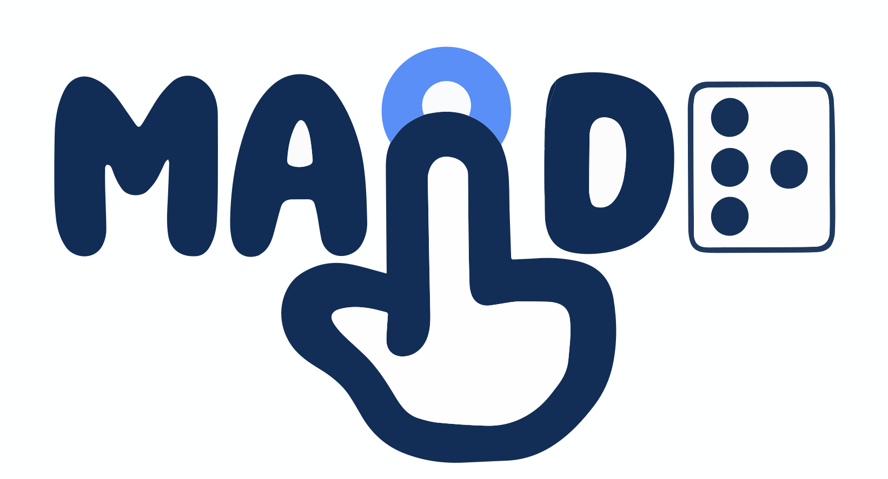

<div align="center">
  
  <hr style="color:transparent" />
  <br />
</div>

# maidr: Multimodal Access and Interactive Data Representation

* **Note:** `maidr` package has been completely rewritten in TypeScript for better architecture and performance. The previous version is now archived at [xability/maidr-legacy](https://github.com/xability/maidr-legacy).

`maidr` (pronounced as 'mader') is a system for non-visual access and control of statistical plots.
It aims to provide an inclusive experience for users with visual impairments by offering multiple modes of interaction:
braille, text, and sonification (BTS).
This comprehensive approach enhances the accessibility of data visualization
and encourages a multi-modal exploration on visualization.
<!-- Check out the current build: [maidr Demo](https://xability.github.io/maidr/galleries/index.html). -->

## Table of Contents

1. [Usage](#usage)
2. [Controls](#controls)
3. [Braille Generation](#braille-generation)
4. [API](#api)
5. [Binders](#binders)
6. [Papers](#papers)
7. [License](#license)
8. [Contact](#contact)
9. [Acknowledgments](#acknowledgments)

## Usage

To use maidr, follow these steps:

1. **Import your plot or plot**: maidr is designed to work seamlessly with scalable vector graphics (SVG) objects for visual highlighting. However, maidr is inherently visual-agnostic, and it also supports other raster image formats such as PNG and JPG without the visual highlight feature. Regardless of the image format, maidr provides support for all non-visual modalities, including Braille, text, and sonification (BTS). Additionally, it offers interactive and artificial intelligence (AI) plot descriptions powered by OpenAI GPT-4 Vision and Google Gemini Pro-Vision. The supported plot types include bar plot, boxplot, heatmap, scatter plot, line plot, histogram, segmented bar plots (e.g., stacked bar plot, side-by-side dodged plot, and normalized stacked bar plot).

2. **Create an HTML file**: Include the main script file `maidr.js` or `maidr.min.js` as well as the stylesheet `styles.css` or `styles.min.css`. Add the SVG of your plot to the main HTML body, and add an ID attribute of your choice to the SVG. Note that this can be automated with R. Your HTML file should now have the following structure:

   ```html
   <!doctype html>
   <html lang="en">
     <head>
       <meta charset="UTF-8" />
       <title>maidr Example</title>
       <link rel="stylesheet" href="https://cdn.jsdelivr.net/npm/maidr/dist/maidr_style.min.css" />
       <script src="https://cdn.jsdelivr.net/npm/maidr/dist/maidr.min.js"></script>
     </head>
     <body>
       <div>
         <!-- Your SVG plot is here -->
       </div>
     </body>
   </html>
   ```

3. Add your data: Include your data as a JSON schema directly in the HTML file. There should be a single `maidr` object with the following properties, or an array of objects if multiple plots exist on the page. Your JSON schema may look like so: (values for demonstration purposes)

   ```javascript
   // a single plot
   let maidr = {
     type: 'box',
     id: 'myboxplot',
     title: 'Highway Mileage by Car Class.',
     axes: {
       y: {
         label: 'Car Class',
         level: [
           '2seater',
           'compact',
           'midsize',
           'minivan',
           'pickup',
           'subcompact',
           'suv',
         ],
       },
       x: { label: 'Highway Milage' },
     },
     selector: '#boxplot1 g[id^="panel"] > g[id^="geom_boxplot.gTree"]',
     data: []
   };

   // or, multiple plots
   maidr = [
     {
       type: 'box',
       id: 'myboxplot',
       title: 'Highway Mileage by Car Class.',
       axes: {
         y: {
           label: 'Car Class',
           level: [
             '2seater',
             'compact',
             'midsize',
             'minivan',
             'pickup',
             'subcompact',
             'suv',
           ],
         },
         x: { label: 'Highway Milage' },
       },
       selector: '#boxplot1 g[id^="panel"] > g[id^="geom_boxplot.gTree"]',
       data: []
     },
     {
       type: 'bar',
       id: 'mybarplot',
       // etc
     }
   ];
   ```

4. Use the following to define the object properties:

   - `type`: the type of plot. Currently supported are 'bar,' 'heat,' 'box,' 'scatter,' and 'line.'
   - `id`: the id that you added as an attribute of your main SVG.
   - `title`: the title of the plot. (optional)
   - `axes`: axes info for your plot. `maidr.axes.x.label` and `maidr.axes.y.label` will provide axes labels, and `maidr.axes.x.level` or `maidr.axes.y.level` (x or y, not both) will provide level or tick mark labels.
   - `data`: the main data for your plot. See below.

5. Define your data set using the `maidr.data` property. This comes in different formats depending on a plot type:

   ```javascript
   let maidr;

   // barplot maidr.data structure: a simple array of values
   maidr = {
     data: [929539693, 898871185, 3811953828, 586098530, 24549948],
   };

   // heatmap maidr.data structure: a 2D array of values
   maidr = {
     data: [
       [124, 0, 0],
       [0, 68, 0],
       [44, 56, 52],
     ],
   };

   // boxplot maidr.data structure: an array of objects with properties lower_outlier, min, q1, q2, q3, max, and upper_outlier
   maidr = {
     data: [
       {
         lower_outlier: null,
         min: 23,
         q1: 24,
         q2: 25,
         q3: 26,
         max: 26,
         upper_outlier: null,
       },
       {
         // etc
       },
     ],
   };

   // scatterplot maidr.data: an object containing x and y properties, each with an array of float values
   // note that data is an array here as scatterplots are often combine with line plots
   maidr = {
     data: [
       {
         x: [1.8, 1.8, 2, 2, 2.8, 2.8, 3.1, 1.8, 1.8, 2, 2, 2.8, 2.8, 3.1, 3.1],
         y: [29, 29, 31, 30, 26, 26, 27, 26, 25, 28, 27, 25, 25, 25, 25, 24],
       },
       // line data could go here
     ],
   };

   // smooth line maidr.data: an object containing x and y properties, each with an array of float values
   // note that data is an array here as scatterplots are often combine with line plots
   maidr = {
     data: [
       // scatterplot data could go here
       {
         x: [1.8, 1.8, 2, 2, 2.8, 2.8, 3.1, 1.8, 1.8, 2, 2, 2.8, 2.8, 3.1, 3.1],
         y: [29, 29, 31, 30, 26, 26, 27, 26, 25, 28, 27, 25, 25, 25, 25, 24],
       },
     ],
   };
   ```

6. If multiple plots are overlaid on the same SVG, the `type` and `data` properties can be an array instead of a single value. Be sure the order is matched between them. The final JSON schema could look like so:

   ```javascript
   const maidr = {
     type: ['point', 'smooth'],
     id: 'scatter1',
     title: 'Highway Mileage by Engine Displacement.',
     name: 'Tutorial 4: Scatterplot',
     selector: [
       'g[id^="geom_point"] > use',
       'g[id^="geom_smooth.gTree"] > g[id^="GRID.polyline"] > polyline[id^="GRID.polyline"]',
     ],
     axes: {
       x: {
         label: 'Engine Displacement',
       },
       y: {
         label: 'Highway Mileage',
       },
     },
     data: [
       {
         x: [
           1.8,
           1.8,
           2,
           2,
           2.8,
           2.8,
           3.1,
           1.8,
           1.8,
           2,
           2,
           2.8,
           2.8,
           3.1,
           3.1,
           2.8,
         ],
         y: [29, 29, 31, 30, 26, 26, 27, 26, 25, 28, 27, 25, 25, 25, 25, 24],
       },
       {
         x: [
           1.6,
           1.6684,
           1.7367,
           1.8051,
           1.8734,
           1.9418,
           2.0101,
           2.0785,
           2.1468,
           2.2152,
           2.2835,
           2.3519,
           2.4203,
           2.4886,
           2.557,
           2.6253,
         ],
         y: [
           33.0929,
           32.5108,
           31.9422,
           31.3885,
           30.8509,
           30.33,
           29.8239,
           29.3334,
           28.8584,
           28.3981,
           27.9519,
           27.5189,
           27.0988,
           26.6958,
           26.3091,
           25.9356,
         ],
       },
     ],
   };
   ```

For more information and examples, refer to the example HTML files provided in the repository.

## Controls

To interact with the plots using maidr, follow these steps:

1. Press the **Tab** key to focus on the SVG element.
2. Use the **arrow keys** to move around the plot.
3. Press **B** to toggle Braille mode.
4. Press **T** to toggle Text mode.
5. Press **S** to toggle Sonification (tones) mode.
6. Press **R** to toggle Review mode.

Below is a detailed list of keyboard shortcuts for various functions:

| Function                                | Key (Windows)               | Key (Mac)                   |
| --------------------------------------- | --------------------------- | --------------------------- |
| Move around plot                        | Arrow keys                  | Arrow keys                  |
| Go to the very left, right, up, or down | Control + Arrow key         | Command + Arrow key         |
| Select the first element                | Control + Home              | Command + Function + Left   |
| Select the last element                 | Control + End               | Control + Function + Right  |
| Toggle Braille Mode                     | B                           | B                           |
| Toggle Sonification Mode                | S                           | S                           |
| Toggle Text Mode                        | T                           | T                           |
| Toggle Text Mode                        | R                           | R                           |
| Repeat current sound                    | Space                       | Space                       |
| Auto-play outward in direction of arrow | Control + Shift + Arrow key | Command + Shift + Arrow key |
<!-- | Auto-play inward in direction of arrow  | Alt + Shift + Arrow key     | Option + Shift + Arrow key  | -->
| Stop Auto-play                          | Control                     | Command                     |
| Auto-play speed up                      | Period                      | Period                      |
| Auto-play speed down                    | Comma                       | Comma                       |

<!-- ### Scatter Plot Controls

In the scatter plot, there are two layers: point mode (layer 1) and line mode (layer 2).
To switch between these layers, use the Page Up and Page Down keys:

- Press Page Up to move from point mode to line mode
- Press Page Down to move from line mode to point mode

Note that this control scheme can be used by any plot with multiple types. -->

### Segmented Bar Controls

In the various segmented bar plots (stacked bar, dodged bar, and normalized stacked bar),
Up, Down, Left, and Right controls function similar to a grid:

- Left and Right arrows move between different bars or points on the x-axis.
- Up and Down arrows move between different layers of the same bar or point on the x-axis.

Note that there are also pseudo layers at the top of each layer stack: a Summary layer representing a sum of all that bar's values, and a Combined layer that plays a separated or combined run of tones of all the layers. The standard 'S' key that controls sonification now has an extra setting to play either combined tones or separated tones.

## Braille Generation

MAIDR incorporates a Braille mode that represents the plot using Braille symbols.
This allows users with visual impairments to explore and interact with the plot using a refreshable Braille display.
To achieve this,
our system translates the plot's visual elements and data points into a corresponding tactile representation
using Braille patterns.
For different plot types, such as bar plot, boxplot, heatmap, and scatter plot,
maidr employs unique encoding strategies tailored to effectively convey the data distribution, patterns, and trends.
These tactile encodings range from using distinct Braille characters to represent value ranges,
to using characters that visually resemble the corresponding sections of a plot.
By providing a comprehensive Braille representation for various plot types,
maidr enables users with visual impairments to gain a deeper understanding of the underlying data and its insights.

### Bar plot

In the Braille representation of a bar plot,
data values are encoded as Braille characters based on their relative magnitude within the plot.
Low values are denoted by Braille characters that have dots only along the bottom,
while high values are indicated by characters that have dots along the top.
Given the four height levels of Braille, the encoding is as follows:

- ⣀ represents values 0 to 25%
- ⠤ represents 25% to 50%
- ⠒ represents 50% to 75%
- ⠉ represents 75% to 100%

This tactile encoding allows users to easily differentiate between the various value ranges in the bar plot,
facilitating their understanding of the data distribution and its underlying trends.

### Heatmap

In the Braille representation of a heatmap, values are depicted based on their relative magnitude within the plot,
much like the approach used for bar plots and scatter plots.
Low values are denoted by Braille characters with dots only along the bottom,
high values are represented by characters filled with dots, and blank or null values are indicated by empty spaces.
With three height levels of Braille, the encoding is as follows:

- ⠤ represents values from 0% to 33%
- ⠒ represents values from 33% to 66%
- ⠉ represents values from 66% to 100%
- "⠀" (braille space) represents null or empty values
- "⢳" represents a row separator

### Box plot

The Braille representation of a boxplot uses Braille characters
that visually resemble the corresponding sections of the boxplot.
An example of such braille may look like `⠂ ⠒⠒⠒⠒⠒⠒⠿⠸⠿⠒ `.
The size of each section is denoted by the number of Braille characters used.
The sections are encoded as follows:

- ⠂ represents lower outlier and upper outlier(s)
- ⠒ represents the left or right whiskers
- ⠿ represents the second or third quartiles
- ⠸⠇ represents the 50% midpoint (median)
- blank spaces represent empty spaces

We also impose some overarching rules:

1. Each section must be represented with at least one braille character, assuming they have some positive length.
2. Differences or equalities in whiskers and quartiles must be upheld. That is, if the min and max whisker are of equal length, they must have the same number of braille characters, or if they're different, the number of characters must be different.
3. A set character always represents zero length sections, such as outliers and the median. ⠂ in the case of outliers, ⠸⠇ in the case of the median.

This tactile encoding enables users to discern the various components of the boxplot, allowing them to comprehend the data distribution, detect outliers, and identify central tendencies and dispersion within the dataset.

To generate the braille, we use an algorithm that generates a distribution of characters based on a given proportional distribution and a specified total number of characters in the user's braille display. This can be described mathematically as follows:

c*i = round(n * p*i), for i = 1, 2, 3, ..., k
c_i = round((n - C) * p_i), for i = 1, 2, 3, ..., k

Where

- n: Total number of characters (integer)
- C: Total number of length 0 characters to offset the total characters (outliers and median) (integer)
- p_i: Proportional distribution of each category i, where i ∈ {1, 2, 3, ..., k} (real numbers, 0 ≤ p_i ≤ 1, and the sum of all p_i equals 1)
- c_i: Number of characters for each category i (integer)

The process is as follows in the code:

1. We first convert our data set for a particular boxplot to an array of lengths.
2. We then assign the single required character to each section.
3. We also note connected sections, such as min and max.
4. We then normalize and allocate all remaining characters according to their proportional distribution, making sure to add extra characters where needed to keep differences or equalities.

As an example, consider a boxplot with the following distribution: [10, 0, 20, 40, 30, 0, 30, 60, 50, 30, 0, 10, 0], with types [blank space, outlier, larger blank space, large min whisker, moderate sized lower quartile, the median, moderate sized upper quartile, another larger max whisker, a large blank space, an outlier, a small blank space, then another outlier], and a braille display length of 33. We would produce braille that looks like so:

⠂ ⠒⠒⠒⠒⠿⠿⠿⠸⠇⠿⠿⠿⠒⠒⠒⠒⠒⠒ ⠂ ⠂

### Scatter plot

In the Braille representation of a scatter plot, the encoding is performed only for the line layer (layer 2).
The method is similar to that used for bar plots,
wherein data values are represented as Braille characters based on their relative magnitude within the plot.
Low values are denoted by dots along the bottom, while high values are indicated by dots along the top.
With four height levels of Braille, the encoding is as follows:

- ⣀ represents values from 0% to 25%
- ⠤ represents values from 25% to 50%
- ⠒ represents values from 50% to 75%
- ⠉ represents values from 75% to 100%

### Segmented Bar Plots

Stacked bar, dodged bar, and normalized stacked bar all share the same system:

In the braille representation of segmented bar plots, braille depends on where you are. There are typically multiple levels to a segmented bar plot, and as you move (Up and Down arrow keys) between levels, the braille changes to represent your current level. At the top, there is also a Summary pseudo level of all levels added together, and a Combined pseudo level of each level separately.

- Regular level: Braille appears similar to a bar plot, with braille values corresponding to the size of the level's value for this point.
- Summary level: Same as regular level, but values now reflect the combined size of all levels' values for this point.
- Combined level: Similar to heatmap, where there are groups of magnitudes for each point separated by a ⢳ character. The first group has braille characters for each level for the first point, then a separator, then the second group has braille characters for each level in the second point, then a separator, and so on.

### Line plot

In the Braille representation of a line plot, braille is nearly identical to the above bar plot:
data values are encoded as Braille characters based on their relative magnitude within the plot.
Low values are denoted by Braille characters that have dots only along the bottom,
while high values are indicated by characters that have dots higher up.

## API

MAIDR is available via a restful API.
Learn more about the usage at [maidr-api](https://github.com/xability/maidr-api) repo.

## Binders

We currently provide the following binders, all of which can be found at each repo:

- [x] Python binder for matplotlib and seaborn: [Py maidr](https://github.com/xability/py-maidr).

- [ ] R binder for ggplot2: [r maidr](https://github.com/xability/r-maidr).

## Papers

To learn more about the theoretical background and user study results, we recommend you read and cite the following papers.

1. [MAIDR: Making Statistical Visualizations Accessible with Multimodal Data Representation](https://dl.acm.org/doi/10.1145/3613904.3642730):

```tex
@inproceedings{seoMAIDRMakingStatistical2024,
  title      = {{{MAIDR}}: {{Making Statistical Visualizations Accessible}} with {{Multimodal Data Representation}}},
  shorttitle = {{{MAIDR}}},
  booktitle  = {Proceedings of the {{CHI Conference}} on {{Human Factors}} in {{Computing Systems}}},
  author     = {Seo, JooYoung and Xia, Yilin and Lee, Bongshin and Mccurry, Sean and Yam, Yu Jun},
  year       = {2024},
  month      = may,
  series     = {{{CHI}} '24},
  pages      = {1--22},
  publisher  = {Association for Computing Machinery},
  address    = {New York, NY, USA},
  doi        = {10.1145/3613904.3642730},
  urldate    = {2024-05-14},
  abstract   = {This paper investigates new data exploration experiences that enable blind users to interact with statistical data visualizations---bar plots, heat maps, box plots, and scatter plots---leveraging multimodal data representations. In addition to sonification and textual descriptions that are commonly employed by existing accessible visualizations, our MAIDR (multimodal access and interactive data representation) system incorporates two additional modalities (braille and review) that offer complementary benefits. It also provides blind users with the autonomy and control to interactively access and understand data visualizations. In a user study involving 11 blind participants, we found the MAIDR system facilitated the accurate interpretation of statistical visualizations. Participants exhibited a range of strategies in combining multiple modalities, influenced by their past interactions and experiences with data visualizations. This work accentuates the overlooked potential of combining refreshable tactile representation with other modalities and elevates the discussion on the importance of user autonomy when designing accessible data visualizations.},
  isbn       = {9798400703300},
  keywords   = {Accessibility,Blind,Braille Display,Multimodality,Screen Readers,Statistical Visualization}
}
```

2. [Designing Born-Accessible Courses in Data Science and Visualization: Challenges and Opportunities of a Remote Curriculum Taught by Blind Instructors to Blind Students](https://diglib.eg.org/items/5e71b594-3762-4604-a9c4-96623cda8bc3):

```tex
@inproceedings{10.2312:eved.20241053,
  booktitle = {EuroVis 2024 - Education Papers},
  editor    = {Firat, Elif E. and Laramee, Robert S. and Andersen, Nicklas Sindelv},
  title     = {{Designing Born-Accessible Courses in Data Science and Visualization: Challenges and Opportunities of a Remote Curriculum Taught by Blind Instructors
               to Blind Students}},
  author    = {JooYoung Seo and Sile O'Modhrain and Yilin Xia and Sanchita Kamath and Bongshin Lee and James M. Coughlan},
  year      = {2024},
  publisher = {The Eurographics Association},
  isbn      = {978-3-03868-257-8},
  doi       = {10.2312/eved.20241053}
}
```

## License

This project is licensed under the GPL 3 License.

## Contact

For any inquiries or suggestions, please contact the principal investigator:

JooYoung Seo - jseo1005@illinois.edu

## Acknowledgments

This project is conducted through the (x)Ability Design Lab at the University of Illinois at Urbana-Champaign, and funded by multiple grants, including:

- The National Science Foundation (NSF) \#2348166

- The Institute of Museum and Library Services (IMLS) \#RE-254891-OLS-23

- Teach Access Faculty Grant

- The Wallace Foundation Grant and the International Society of the Learning Sciences

- The PI's faculty startup grant
